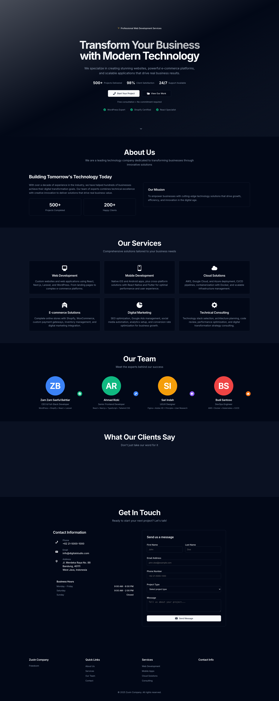

# WP Company Theme

A modern WordPress company profile theme built with shadcn/ui design system and dark mode aesthetic.



## ✨ Features

- **Modern Design** - Built with shadcn/ui design system
- **Dark Mode** - Professional dark theme as default
- **Responsive** - Mobile-first responsive design
- **Auto-scrolling Testimonials** - Smooth marquee animation
- **Custom Post Types** - Services, Team, Testimonials
- **Docker Ready** - Complete development environment
- **SEO Optimized** - Proper meta tags and accessibility

## 🚀 Quick Start

1. **Clone the repository**
   ```bash
   git clone https://github.com/zsbahtiar/wp-company.git
   cd wp-company
   ```

2. **Start with Docker**
   ```bash
   docker-compose up -d
   ```

3. **Access your site**
   - WordPress: http://localhost:8080
   - Database: localhost:3307

## 📁 Structure

```
wp-company/
├── company-theme/          # WordPress theme
├── company-features/       # Custom plugin
├── docker-compose.yml      # Docker configuration
└── showcase/              # Screenshots
```

## 🎨 Sections

- **Hero** - Full-height landing with CTA buttons
- **About** - Company overview with stats
- **Services** - 6 comprehensive service offerings
- **Team** - Team members with Indonesian names
- **Testimonials** - Auto-scrolling client reviews
- **Contact** - Contact form with business hours

## 🛠️ Built With

- WordPress 6.4
- shadcn/ui Design System
- Custom CSS with CSS Variables
- Dashicons & SVG Icons
- Docker & MySQL

## 📞 Demo Contact

- Phone: +62 21-5000-1000
- Email: info@digitalstudio.com
- Address: Jl. Merdeka Raya No. 88, Bandung, West Java

---

**Created by [Zam Zam Saeful Bahtiar](https://github.com/zsbahtiar)**